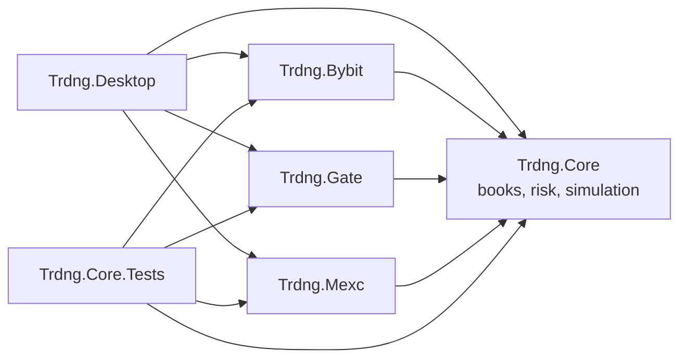
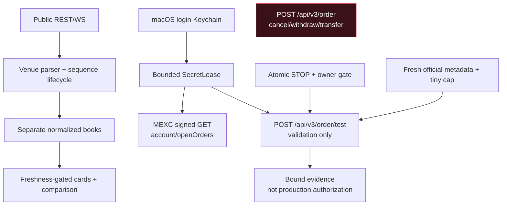

# TRDNG architecture

TRDNG is a small .NET monorepo. Core owns venue-neutral invariants, venue projects translate official exchange contracts, and Desktop composes the macOS UI. Dependencies point inward.

## Data and trust boundaries

Public data contains no credentials. Read-only and order-test MEXC credentials use separate Keychain identities. Secrets are leased briefly and excluded from UI, audit and journals. Redirects, cookies and unsafe retries are disabled. The test path allows only `/order/test`; the production route is absent.

## State and lifecycle

- Selection is canonical `asset + product`, generation-scoped and latest-request-wins; old callbacks cannot populate a new selection.
- Each book owns snapshot/delta continuity and resync. Warning data may compare; stale data is excluded.
- Dry-run intent is immutable and targets exactly one venue. STOP starts engaged; confirmation is exact, expiring and single-use.
- Simulation is journaled locally. Ambiguous recovery becomes `Unknown/RequiresReconciliation` and never retries automatically.
- Probe evidence binds candidate and canonical wire-body fingerprints but cannot become production-filter or S4 authorization.

## Sources of truth

- [Stage 1 plan](stage-1-plan.md)
- [Stage 1 ledger](stage-1-ledger.md)
- [Canonical document index](source-of-truth.md)
- [Security policy](../SECURITY.md)
