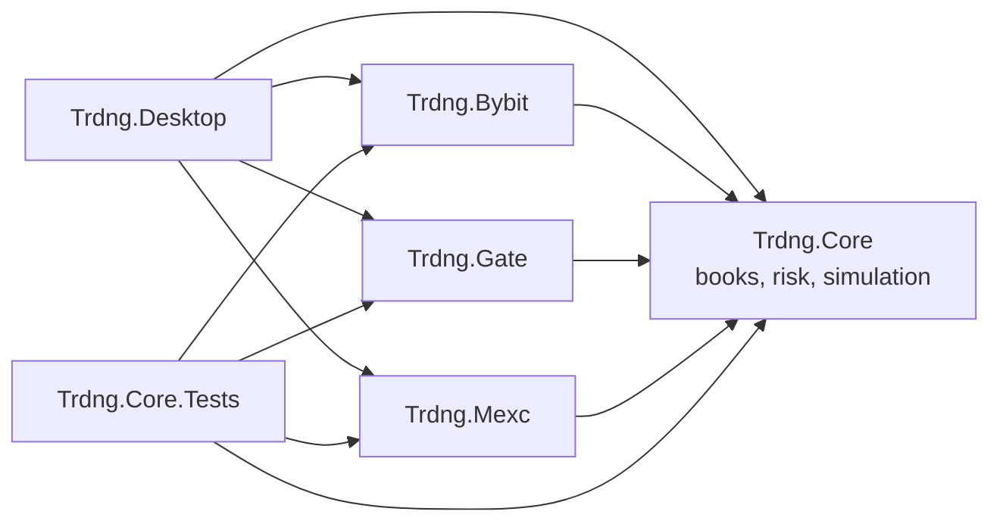
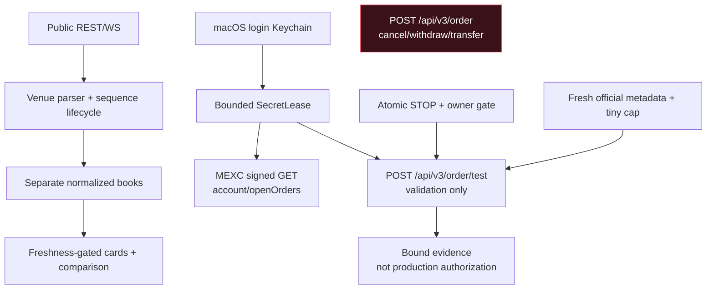

# TRDNG architecture

TRDNG is a small .NET monorepo. Core owns venue-neutral invariants, venue projects translate official exchange contracts, and Desktop composes the macOS UI. Dependencies point inward.

## Data and trust boundaries

Public data contains no credentials. Read-only and order-test MEXC credentials use separate Keychain identities. Secrets are leased briefly and excluded from UI, audit and journals. Redirects, cookies and unsafe retries are disabled. The test path allows only `/order/test`; the production route is absent.

Every public WebSocket connection passes complete text and binary messages through
one fixed-size pooled envelope before any venue parser runs. The shared hard limit
is 1 MiB. Fragmented messages are counted cumulatively; an oversized or
type-inconsistent message is rejected with a stable safe code, the partial buffer
is reset, and the venue session follows its existing reconnect/resynchronization
path. Raw WebSocket payloads are not included in that error or in MEXC text-frame
diagnostics.

All public REST metadata, catalog and MEXC depth-snapshot responses pass through
one bounded streaming reader before JSON parsing. It performs a declared-length
precheck and reads at most one byte beyond an endpoint-specific success cap;
error bodies and unexpected media types are not parsed or logged. Live public
market-data REST uses a five-second client; the larger startup catalog client has
a separate 15-second boundary. Redirects and cookies are disabled for both.
Current caps are 4 MiB per Bybit instrument page, 8 MiB for Gate contracts and
MEXC exchange info, 2/8 MiB for MEXC Spot depth 1,000/5,000, and 4 MiB for
MEXC perpetual depth. MEXC perpetual books currently poll the official public
REST snapshot and do not claim WebSocket continuity.

Normalized order books are bounded by a venue-configured
`OrderBookCapacityPolicy`. Snapshots validate into replacement state; deltas
validate their complete change set and projected side counts/cross before any
mutation. Policy failure never truncates a book: the venue session clears state
and requires resynchronization. MEXC also bounds the total number of levels held
before its REST snapshot bridge. Current trade-cluster intervals have independent
price-level and trade-count caps; an overflowed partial interval is suppressed
and reported through core metrics.

Local memory observability is deliberately process-local and bounded. The
deterministic soak tool replays bounded books, clusters and market-selection
lifecycle without network or credentials, retains a fixed sample window and
emits counter-only JSONL. It is not production telemetry. Native macOS release
evidence still comes from the exact signed app with `footprint` and `vmmap`;
missing runtime private-memory counters are represented as unavailable rather
than zero.

The live UI is also bounded: producers replace one latest snapshot per venue and
set one global dirty bit; a UI-owned timer renders at most 10 Hz. Existing row
view models are updated in place instead of clearing/recreating every visual row.
Every macOS GUI/soak launch must use the exact-hash process-tree watchdog. The
canonical limits, scale tiers and system-pressure rules are in
[Performance safety](PERFORMANCE-SAFETY.md).

## State and lifecycle

- Selection is canonical `asset + product`, generation-scoped and latest-request-wins; old callbacks cannot populate a new selection.
- Each book owns snapshot/delta continuity and resync. Warning data may compare; stale data is excluded.
- Each venue card owns its display depth, trackpad step, bar-volume reference
  and four-color palette. Automatic volume normalization is independent for the
  visible ask and bid sides; the two books remain unmerged.
- Dry-run intent is immutable and targets exactly one venue. STOP starts engaged; confirmation is exact, expiring and single-use.
- Simulation is journaled locally. Ambiguous recovery becomes `Unknown/RequiresReconciliation` and never retries automatically.
- Probe evidence binds candidate and canonical wire-body fingerprints but cannot become production-filter or S4 authorization.

## Sources of truth

- [Stage 1 plan](stage-1-plan.md)
- [Stage 1 ledger](stage-1-ledger.md)
- [Canonical document index](source-of-truth.md)
- [Security policy](../SECURITY.md)
- [PR-03 bounded HTTP evidence](pr03-bounded-http-evidence.md)
- [PR-04 memory observability evidence](pr04-memory-soak-evidence.md)
- [Memory soak runbook](memory-soak-runbook.md)
- [Performance and runtime-safety contract](PERFORMANCE-SAFETY.md)
- [P0 GUI memory incident evidence](p0-memory-incident-evidence.md)
- [S1.7 and cleanup closure evidence](closure-cleanup-evidence.md)
